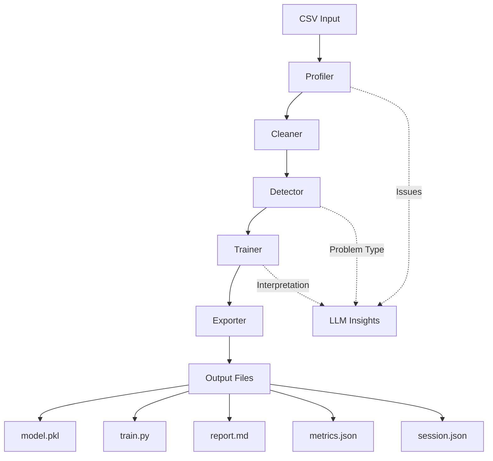

# TrainCLI Project Report

## 📋 Executive Summary

**TrainCLI** is a command-line tool that automates the entire machine learning pipeline from a single command. It enables users to train ML models without writing code, handling data profiling, cleaning, model selection, training, and export automatically.

**Version:** 0.1.1  
**License:** MIT  
**Python:** 3.9+  
**Status:** Beta (Development Status 4)

---

## 🎯 Core Value Proposition

TrainCLI eliminates ML boilerplate by providing:
- **One-command training**: `train --data data.csv --target column`
- **Intelligent automation**: Auto-selects models via cross-validation
- **Smart data handling**: Automatic cleaning with user prompts for ambiguous cases
- **Complete reproducibility**: Generates standalone `train.py` scripts
- **LLM-powered insights**: Optional AI explanations via watsonx.ai or Groq

---

## 🏗️ Architecture Overview

### Pipeline Flow



### Module Structure

| Module | Purpose | Key Functions |
|--------|---------|---------------|
| [`cli.py`](traincli/cli.py:1) | Entry point, command parsing | [`main()`](traincli/cli.py:84), [`init()`](traincli/cli.py:18) |
| [`core.py`](traincli/core.py:1) | Shared pipeline logic for CLI & MCP | [`run_pipeline()`](traincli/core.py:14), [`profile_dataset()`](traincli/core.py:103) |
| [`profiler.py`](traincli/profiler.py:1) | Data analysis & leakage detection | [`profile()`](traincli/profiler.py:123), [`detect_leakage()`](traincli/profiler.py:53) |
| [`cleaner.py`](traincli/cleaner.py:1) | Data cleaning & preprocessing | [`clean()`](traincli/cleaner.py:51) |
| [`detector.py`](traincli/detector.py:1) | Problem type detection | [`detect()`](traincli/detector.py:7) |
| [`trainer.py`](traincli/trainer.py:1) | Model training & evaluation | [`train()`](traincli/trainer.py:52), [`improve()`](traincli/trainer.py:225) |
| [`exporter.py`](traincli/exporter.py:1) | Output generation | [`export()`](traincli/exporter.py:10) |
| [`llm.py`](traincli/llm.py:1) | Optional LLM integration | [`interpret_results()`](traincli/llm.py:112), [`generate_train_py()`](traincli/llm.py:167) |
| [`mcp_server.py`](traincli/mcp_server.py:1) | MCP server for Claude integration | [`train_model`](traincli/mcp_server.py:100), [`profile_dataset`](traincli/mcp_server.py:147) |

---

## 🔧 Key Features Deep Dive

### 1. Data Profiling ([`profiler.py`](traincli/profiler.py:1))

**Capabilities:**
- Detects column types (numeric, categorical, datetime, ID-like, free text)
- Identifies data quality issues (nulls, mixed types, impossible values)
- **Leakage detection** via [`detect_leakage()`](traincli/profiler.py:53):
  - Correlation analysis (>0.98 threshold)
  - Name similarity checks
  - Linear transformation detection

**Example Issue Detection:**
```python
# Detects ID columns via multiple signals
_is_id_column()  # Checks: name hints, sequential patterns, UUID format
```

### 2. Smart Cleaning ([`cleaner.py`](traincli/cleaner.py:1))

**Auto-fixes:**
- ID column removal
- Date parsing → feature extraction (month, day_of_week, year)
- Currency string conversion (`$1,234.56` → `1234.56`)
- Boolean target standardization (`yes/no/true/false` → `0/1`)
- Free text column removal

**Interactive prompts** for ambiguous cases:
- Mixed type columns
- High null percentages (>40%)
- Impossible values

### 3. Problem Type Detection ([`detector.py`](traincli/detector.py:1))

**Heuristic rules** (high confidence):
1. Object/string dtype → classification
2. Boolean dtype → classification  
3. Exactly 2 unique values → classification
4. Float with continuous range → regression
5. Integer with ≤15 unique values → classification (unless large gaps)

**LLM fallback** for low-confidence cases via [`llm.infer_problem()`](traincli/llm.py:68)

### 4. Model Selection ([`trainer.py`](traincli/trainer.py:1))

**Three modes:**
1. **Auto-select** (default): Cross-validation across candidates
2. **Interactive** (`--model ?`): User picks from table
3. **Explicit** (`--model random_forest`): Direct specification

**Meta-model enhancement:**
- Bundled [`meta_model.pkl`](traincli/meta_model.pkl:1) recommends models based on dataset characteristics
- Confirmed via cross-validation before final selection

**Supported models** ([`models/registry.py`](traincli/models/registry.py:1)):

| Classification | Regression |
|----------------|------------|
| Logistic Regression | Linear Regression |
| Random Forest | Ridge Regression |
| Gradient Boosting | Random Forest |
| XGBoost | Gradient Boosting |
| SVM | XGBoost, SVR |

### 5. Export System ([`exporter.py`](traincli/exporter.py:1))

**Generated files:**
- **`model.pkl`**: Trained scikit-learn pipeline (ready to use)
- **`train.py`**: Standalone retraining script with educational comments
- **`report.md`**: Human-readable summary with metrics & interpretation
- **`metrics.json`**: Machine-readable metrics
- **`session.json`**: Complete audit trail of all decisions

**LLM-enhanced `train.py`:**
- Educational comments explaining model choice, preprocessing, results
- Fallback to static comments if LLM unavailable

---

## 🤖 LLM Integration ([`llm.py`](traincli/llm.py:1))

**Provider support:**
- **Groq** (default): Fast, cost-effective
- **IBM watsonx.ai**: Enterprise option

**Use cases:**
1. **Problem type confirmation** when heuristics uncertain
2. **Result interpretation** in plain English
3. **Code comment generation** for `train.py`

**Graceful degradation:**
- All LLM calls are optional
- Falls back to deterministic logic if unavailable
- Can be disabled with `--no-llm` flag

---

## 🔌 MCP Server Integration ([`mcp_server.py`](traincli/mcp_server.py:1))

Enables Claude Desktop to train models directly via Model Context Protocol.

**Available tools:**
1. **`train_model`**: Full pipeline execution
2. **`profile_dataset`**: Data analysis without training
3. **`suggest_target`**: Heuristic target column recommendation

**Setup:**
```json
{
  "mcpServers": {
    "traincli": {
      "command": "traincli-mcp"
    }
  }
}
```

---

## 📊 Session Tracking ([`utils/session.py`](traincli/utils/session.py:1))

The [`Session`](traincli/utils/session.py:6) class tracks every decision:
- Input parameters
- Profile statistics
- Cleaning actions (auto-fixes & user decisions)
- Problem type detection source
- Model selection source
- Final metrics
- Output file paths

**Saved as `session.json`** for complete reproducibility.

---

## 🎨 User Experience ([`utils/display.py`](traincli/utils/display.py:1))

**Rich terminal UI:**
- Color-coded output (success/warning/error)
- Tables for metrics, model selection, profiling
- Panels for important warnings (leakage detection)
- Progress indicators

**Interactive features:**
- Model picker with recommendations
- Cleaning decision prompts
- Confidence level display with reasoning

---

## 📦 Dependencies ([`pyproject.toml`](pyproject.toml:1))

**Core ML:**
- pandas ≥2.0
- scikit-learn ≥1.3
- xgboost ≥2.0
- numpy ≥1.24

**CLI & Display:**
- click ≥8.1
- rich ≥13.0

**LLM (optional):**
- ibm-watsonx-ai ≥1.0.0
- groq (via requests)

**Integration:**
- mcp ≥0.1.0
- python-dotenv ≥1.0

---

## 🚀 Usage Patterns

### Basic Training
```bash
train --data sales.csv --target revenue
```

### With Model Selection
```bash
train --data data.csv --target label --model gradient_boosting
```

### Interactive Mode
```bash
train --data data.csv --target label --model ?
```

### Batch Processing
```bash
train --dir ./datasets/ --target outcome --auto
```

### Leakage Handling
```bash
train --data jobs.csv --target salary --drop min_salary,max_salary
```

### Preview Mode
```bash
train --data data.csv --target col --preview
```

---

## 🔍 Code Quality Observations

### Strengths
1. **Excellent separation of concerns**: Each module has a clear, single responsibility
2. **Graceful degradation**: LLM features are optional, never break the pipeline
3. **Comprehensive error handling**: Try-except blocks with informative fallbacks
4. **Rich documentation**: Docstrings explain parameters and return values
5. **User-friendly**: Interactive prompts with sensible defaults
6. **Reproducibility**: Generated `train.py` is standalone and well-commented

### Areas for Enhancement
1. **Type hints**: Inconsistent usage (some functions have them, others don't)
2. **Testing**: No visible test suite in the repository
3. **Configuration validation**: Could add schema validation for config files
4. **Logging**: Uses print/rich instead of Python's logging module
5. **Meta-model training**: [`meta_collector.py`](traincli/meta_collector.py:1) exists but training script not visible

---

## 🎯 Target Audience

1. **Data Scientists**: Rapid prototyping and baseline models
2. **Developers**: ML integration without deep ML expertise
3. **Students**: Learning ML workflows with educational comments
4. **Researchers**: Quick experiments with reproducible scripts

---

## 🔮 Roadmap (from README)

- [ ] Meta-model for smarter algorithm selection
- [ ] More preprocessing options
- [ ] Feature engineering suggestions
- [ ] Hyperparameter tuning

---

## 💡 Recommendations

### Short-term
1. Add comprehensive test suite (pytest)
2. Implement type hints consistently across all modules
3. Add validation for edge cases (empty datasets, single-column data)
4. Document meta-model training process

### Medium-term
1. Add support for more model types (neural networks, ensemble methods)
2. Implement hyperparameter tuning (GridSearchCV/RandomizedSearchCV)
3. Add feature importance visualization
4. Support for time series problems

### Long-term
1. Web UI for non-CLI users
2. Model versioning and experiment tracking
3. Integration with MLflow or similar platforms
4. Support for distributed training (Dask, Ray)

---

## 📈 Conclusion

TrainCLI is a **well-architected, production-ready tool** that successfully abstracts ML complexity while maintaining transparency and reproducibility. The codebase demonstrates strong software engineering practices with clear module boundaries, graceful error handling, and excellent user experience design.

The optional LLM integration adds educational value without creating dependencies, and the MCP server integration positions it well for AI-assisted workflows. The generated `train.py` scripts ensure users aren't locked into the tool and can customize as needed.

**Overall Assessment:** ⭐⭐⭐⭐½ (4.5/5)
- **Code Quality:** Excellent
- **User Experience:** Outstanding  
- **Documentation:** Very Good
- **Extensibility:** Good
- **Testing:** Needs improvement